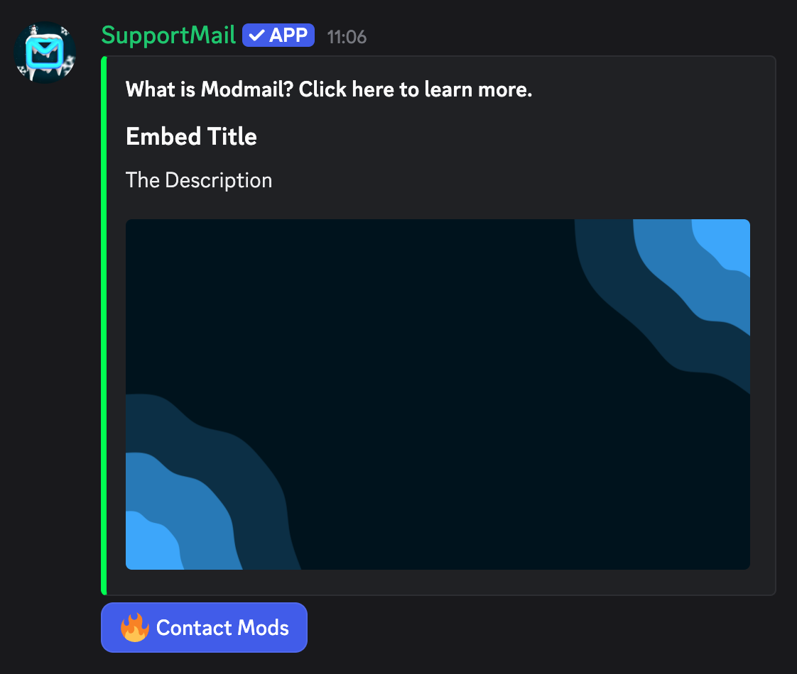

import { Aside } from "@astrojs/starlight/components";
import ImageWrapper from "../../../components/ImageWrapper.astro";

The idea of modmail is, to reduce clutter in your server by removing public support
channels where users can see their tickets and a channel where they can create tickets.

However you might notice, that users might not know how to create tickets in the first place if your users are not the most "discord-savvy".

To solve this, you can create a Panel in your server. A Panel is a message in a specified channel where users can create tickets by interacting clicking a button.

Currently, you can only create a Panel by using the `/config panel` command in your server.
This will be moved to the dashboard in the future with more options, providing a better user experience.

### Example

<ImageWrapper></ImageWrapper>

<Aside type="note">
  The author of the embed can currently not be changed but when the panel builder in the dashboard
  is completed, you will be able to customize the panel completely.
</Aside>
