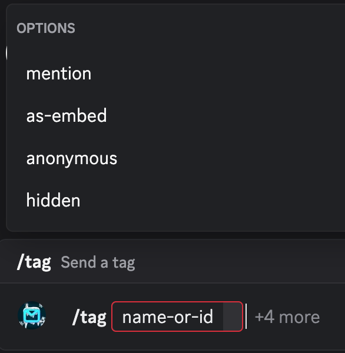
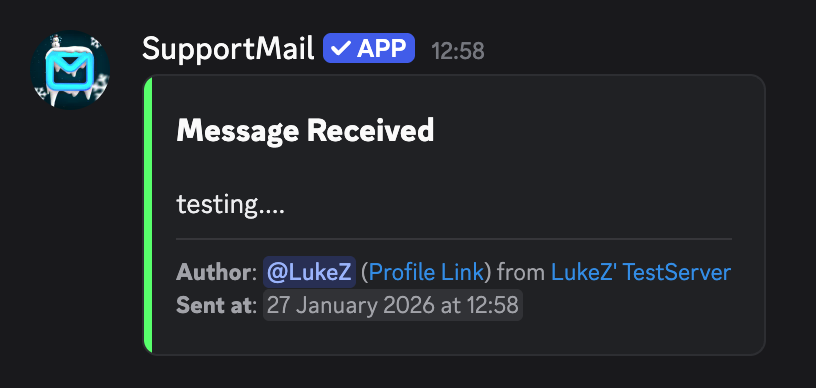
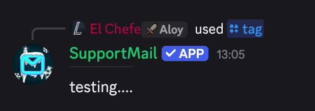
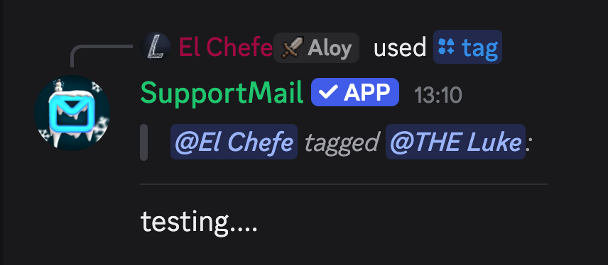
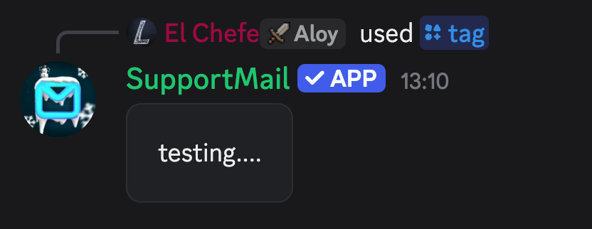
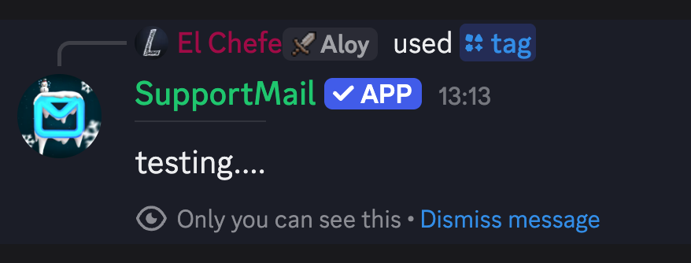

import { Tabs, TabItem, Aside } from "@astrojs/starlight/components";
import ImageWrapper from "../../../components/ImageWrapper.astro";

## What are Tags?

Tags are pieces of reusable text (also known as snippets) that anyone usually can use to quickly send common responses in support tickets or chats (for example).
They help to reduce repetitive typing and ensure consistent communication.

## Managing Tags

You can manage tags in the [dashboard](https://dash.supportmail.dev/?next=tags) or with the `/config tags` command (which has subcommands for adding, removing, and editing tags).

## Using Tags

Tags can be used in- and outside of tickets. The key difference is how they are sent.

You send a tag with the command `/tag` with various options:

<ImageWrapper></ImageWrapper>

| Option       | What is does                                       | Note               |
| ------------ | -------------------------------------------------- | ------------------ |
| `name-or-id` | The name or id of the tag to send                  | Required           |
| `mention`    | Provide a user to mention when sending             | Ignored in tickets |
| `as-embed`   | Send the tag as an embed                           | Ignored in tickets |
| `anonymous`  | Send the tag anonymously                           | Tickets only       |
| `hidden`     | Send the tag as hidden (only you see the response) | Ignored in tickets |

_This is btw also explained in the command descriptions..._

### Tags in Tickets

When sending a tag in a ticket, the tag content is sent directly to the user and it looks like a normal message from the serverteam.

<ImageWrapper></ImageWrapper>

In tickets, you can also provide the `anonymous` option to send the tag without revealing your identity.

### Tags outside of Tickets

When sending a tag outside of tickets (for example in a server channel), the tag is sent as a bot message and not as a reply to the slash command.

There you can also provide the `mention`, `as-embed`, and `hidden` options to customize how the tag is sent.

<ImageWrapper></ImageWrapper>

<Tabs>

<TabItem label="With Mention">
  <ImageWrapper></ImageWrapper>

  <Aside type="note">
    Only the selected user will be mentioned, nobody else - even though the author is visible. Their mention is just disabled.
  </Aside>
</TabItem>

<TabItem label="As Embed">
  <ImageWrapper></ImageWrapper>

  <Aside type="note">
  It is still referred to as "as embed" even though they were migrated to the new Components V2 look - which still has the shape of an embed, but is not an actual Discord embed.
  </Aside>
</TabItem>

<TabItem label="Hidden">
  <ImageWrapper></ImageWrapper>

  <Aside type="note">
    Fun fact: "Hidden" is actually called "ephemeral" - hidden is just a more user-friendly term for it.
  </Aside>
</TabItem>

</Tabs>
