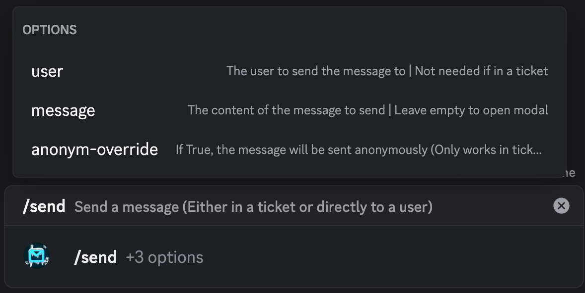
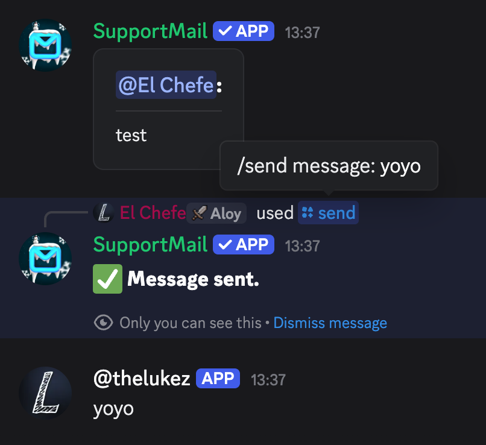
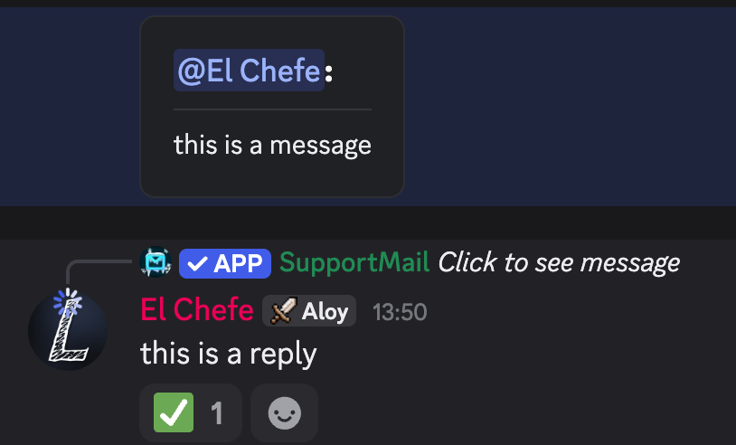
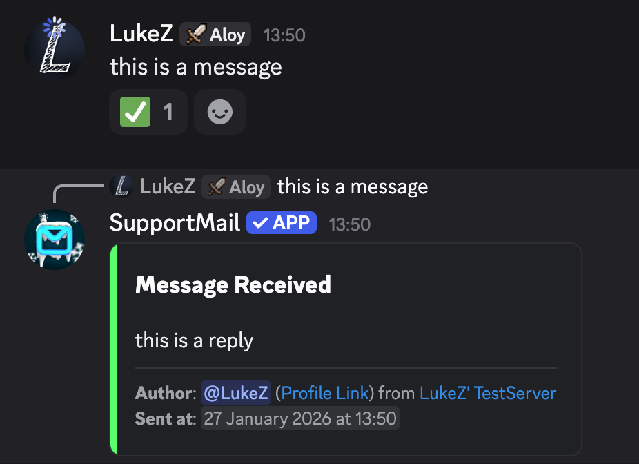

import { Aside } from "@astrojs/starlight/components";
import ImageWrapper from "../../../components/ImageWrapper.astro";

Welcome to the guide on handling support tickets. This document is addressed to moderators and supporters who are responsible for managing user inquiries and issues.

## Ticket Creation

When a user wants to contact support, they will eventually need to DM the bot, whether this is triggered by a command, panel or by DMing the bot.
After the user completed the whole process, a ticket will be created. The user does not see that "a ticket was created", but will see "message sent".

In the server, a ticket post will be created in the ticket forum. This post contains all relevant information about the ticket, including user details and the initial message.  
Tickets with SupportMail are handled in a private ticket forum. Tickets are created as ticket posts in this forum. This removes the need for a transcript because the posts are locked and archived.

## Interacting with the user

In this ticket post, staff can interact with the user by just sending messages in the ticket post. These messages will be forwarded to the user via DM, depending on the configuration.

### Automatic Forwarding

Server managers can configure whether messages sent in the ticket post are automatically forwarded to the user. Automatic forwarding is the default behavior.
If automatic forwarding is disabled, there are 3 ways to send messages to the user:

#### 1. Using the `/send` command

<ImageWrapper></ImageWrapper>

The `/send` command lets staff send a message directly to a user or to the user associated with the current ticket.
It's useful when automatic forwarding is disabled or when you want to message a user outside of the ticket workflow.

##### Options

- `user` (optional): The user to send the message to. Not required when used inside a ticket post.
- `message` (optional): The content to send. Leave empty to open the interactive modal.
- `anonym-override` (True/False): If True, the message will be sent anonymously. This only works when used inside a ticket.

##### Behavior

- In a ticket post: You can omit the user option and the bot will send the message to the ticket's author. Use anonym-override if you need an anonymous reply.
- Outside a ticket: Supply the user option to send a direct message to that user.
- Leaving the message blank opens the command modal to write longer replies.

In a ticket, the bot will send the sent mesage in the ticket post as well, using a webhook to mimic your user.

<ImageWrapper>
  
</ImageWrapper>

##### Failures and edge cases

- If the recipient has DMs disabled or has blocked the bot, the message will fail and you'll receive an error.
- Anonymous sending only applies to ticket replies and respects server configuration.

#### 2. Use a flag or mention the bot

You can also use a special flag `-r` or mention the bot at the start of your message. This tells the bot to
forward the message to the ticket's author and will be removed from the content before sending it to the user.

##### Examples

- `-r Hello, how can I help you?`
- `@SupportMail Hello, how can I help you?`

### Replies

A niche feature is that you can reply to user messages in the ticket post and the bot will mimic this reply in the user's DMs.
This helps to keep conversations clear and structured.

  <ImageWrapper></ImageWrapper>
  <ImageWrapper class="mt-0">
    
  </ImageWrapper>

## Closing Tickets

When the issue is resolved, staff can close the ticket using the `/close` command within the ticket post.
This action will archive the ticket post and **won't** notify the user by default. If you want to notify the user about the closure, provide a comment or provide the appropriate option.

You can also provide the `share-comment` option, which, if **True**, will make the bot send the user the provided comment when closing the ticket.
If **False**, the user will not receive the comment. By default, the option is **True**.

Another way to notify the user about the ticket's closure, is by having [Feedback](/managing-support/feedback) enabled
which will result in a note and feedback components to rate the support being added to the direct message to the user.

## Close Requests

Tickets can't be closed by users directly. Instead, you can ask the user if they want to close the ticket using the `/close-request create` command. This will send a message to the user asking if they want to close the ticket.

You can provide a comment and the `share-comment` option again. The user will see the comment when they receive the close request, if not otherwise specified.

<Aside type="caution">
  If **anyone** responds in the ticket while a close request is open, the close request will be
  automatically cancelled.
</Aside>

### Timed Close Requests

You can also provide a `close-time` option when creating a cose request. This will automatically close the ticket after the specified time if the user does not respond.

See [Timestrings](/guides/timestrings) for more information on how to set the time correctly.

### Deleting Close Requests

If you need to cancel an open close request, you can use the `/close-request delete` command within the ticket post.
This will remove the close request and silently delete the notification in the user's DMs.

## Reopening Tickets

If a ticket was closed but because God knows why someone wants to open it again, staff can use the `/reopen` command - follow the available options and read their descriptions and the ticket will be reopened.

## Anonymous Replies

Managers can configure whether messages in ticket posts are forwarded anonymously to the user. This is useful if staff want to maintain privacy or you have multiple staff members working on common tickets on a regular basis.

## Anonymous Tickets

Users can create anonymous tickets if a server has this feature enabled. In anonymous tickets, the user's identity is hidden from staff members. Staff will see a radnom nickname and avatar instead of the user's actual Discord username and avatar.

If a user abuses this and misbehaves, take a look at [Blacklisting](/managing-support/blacklisting) to prevent the user from creating further tickets.
